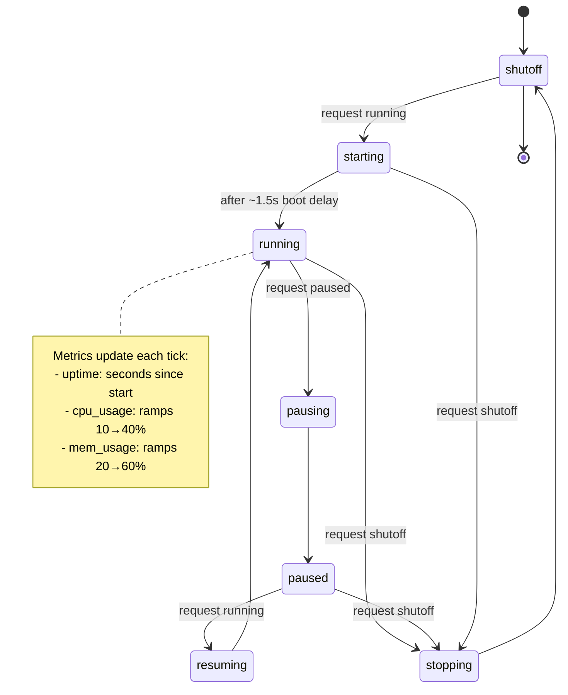

The mock libvirtd service simulates realistic domain (VM) lifecycle management through a goroutine-based state machine. Each domain runs its own background state machine that handles transitions, boot delays, and metric updates.

## State Diagram



## State Definitions

### User-Requested States

| State | Description |
|-------|-------------|
| `running` | VM is powered on and operating |
| `shutoff` | VM is powered off |
| `paused` | VM is suspended (CPU paused but memory preserved) |

### Intermediate States (Internal)

| State | Description |
|-------|-------------|
| `starting` | VM is booting (transient, ~1.5s delay) |
| `stopping` | VM is shutting down (transient) |
| `pausing` | VM is pausing (transient) |
| `resuming` | VM is resuming from pause (transient) |

## Valid Transitions

| From | To | Notes |
|------|-----|-------|
| `shutoff` | `running` | Triggers boot via `starting` |
| `starting` | `running` | Automatic after boot delay |
| `running` | `paused` | Direct transition |
| `paused` | `running` | Direct transition |
| `running` | `shutoff` | Triggers shutdown via `stopping` |
| `paused` | `shutoff` | Triggers shutdown via `stopping` |
| `stopping` | `shutoff` | Automatic |
| `starting` | `shutoff` | Cancel boot request |

Invalid transitions return **HTTP 409 Conflict**.

## API Response Behavior

When a state change is requested:

1. **Immediate response**: Shows the *desired* state (what was requested)
2. **Actual state**: Transitions asynchronously via state machine
3. **Polling**: Clients can GET to see real state after transitions complete

This matches real libvirtd behavior - API acknowledges intent immediately while OS-level operations complete in background.

## Metrics

| Metric | Formula | Notes |
|--------|---------|-------|
| **Uptime** | `time.Since(StartedAt)` | Resets to 0 when shutoff |
| **CPU Usage** | `10 + (uptime/5) * 30` | Ramps 10%→40% over 5s, capped at 40% |
| **Memory Usage** | `20 + (uptime/3) * 40` | Ramps 20%→60% over 3s, capped at 60% |

## Example

### Start a VM

```bash
curl -X PUT http://localhost:8080/api/domains/{id} \
  -H "Content-Type: application/json" \
  -d '{"state": "running"}'
```

Response (immediate):
```json
{
  "id": "uuid",
  "state": "running",
  "started_at": 1717951234567,
  "uptime": 0
}
```

After 2 seconds:
```json
{
  "id": "uuid",
  "state": "running",
  "started_at": 1717951234567,
  "uptime": 2,
  "cpu_usage": 15.5,
  "mem_usage": 35.2
}
```

### Stop a VM

```bash
curl -X PUT http://localhost:8080/api/domains/{id} \
  -H "Content-Type: application/json" \
  -d '{"state": "shutoff"}'
```

## Configuration

| Environment Variable | Default | Description |
|---------------------|---------|-------------|
| `BOOT_TIME_MS` | 1500 | Boot delay in milliseconds |
| `STATE_TICK_RATE_MS` | 100 | State machine check interval |